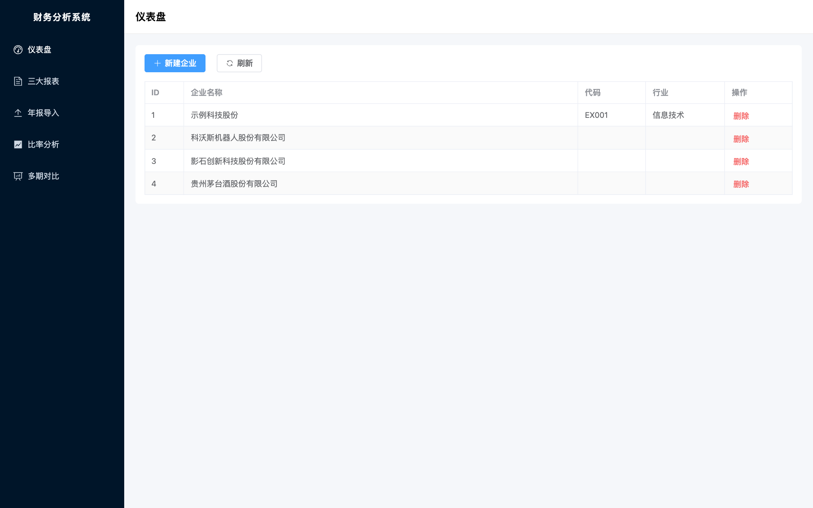
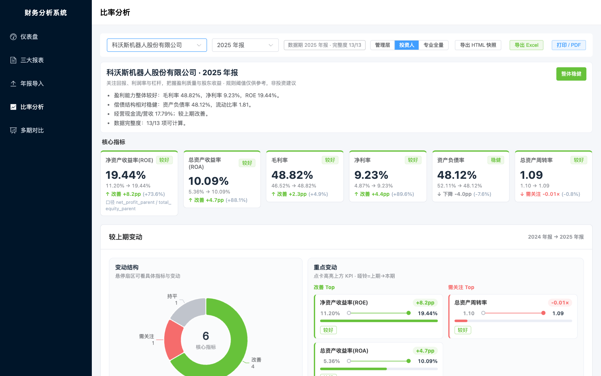
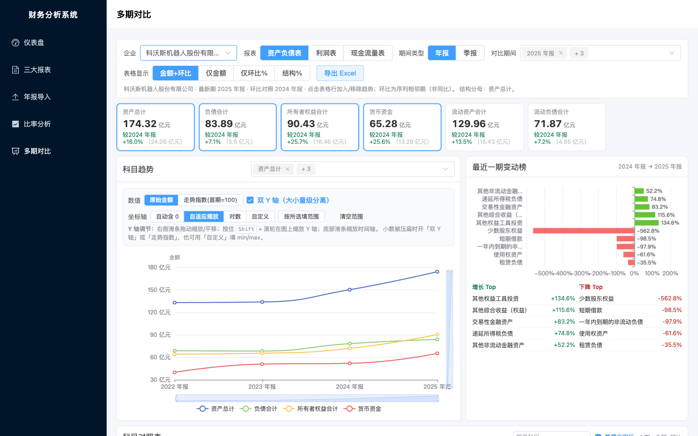
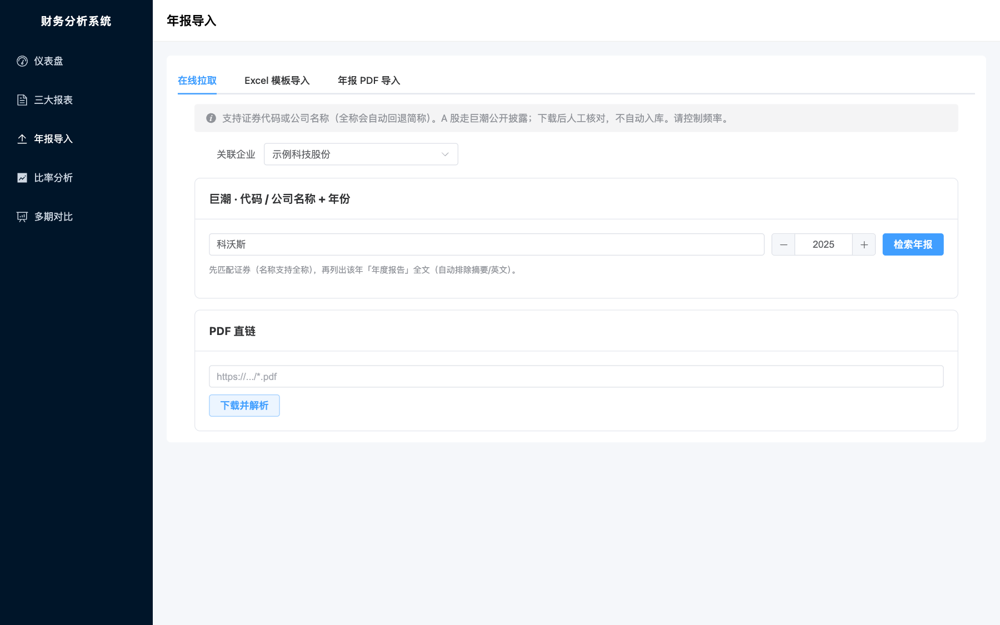
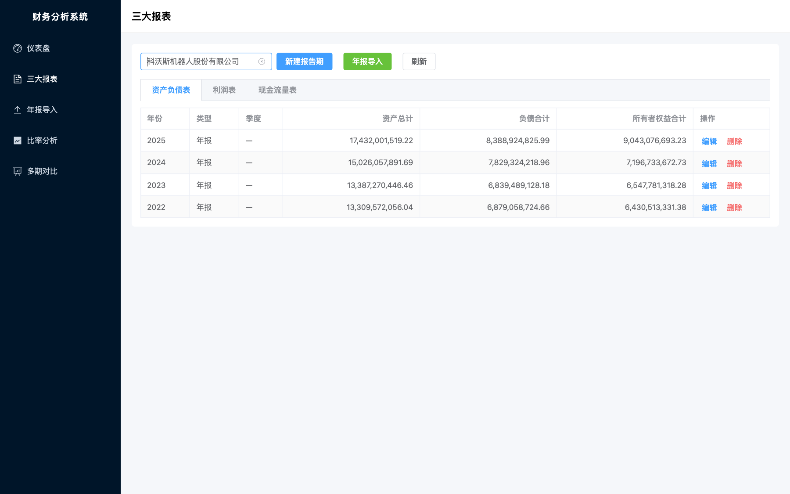

# Web_Financial_Analyse

轻量级**企业财务报表分析系统**：三大报表录入与存储、公开年报导入（PDF / Excel / 巨潮在线拉取）、财务比率分析、科目级多期对比。  
单机本地运行，无认证，数据落在本机 SQLite。

[](https://www.python.org/)
[](https://vuejs.org/)
[](https://fastapi.tiangolo.com/)
[](#说明)

---

## 界面预览

### 仪表盘 · 企业档案



### 比率分析 · KPI / 较上期变动 / 健康摘要



### 多期对比 · 科目趋势与变动榜



### 年报导入 · 巨潮在线拉取 / Excel / PDF



### 三大报表 · 多期列表与录入



---

## 功能一览

| 模块 | 能力 |
|------|------|
| **企业与报表** | 企业档案；资产负债表 / 利润表 / 现金流量表 CRUD；年报 / 季报 |
| **年报导入** | PDF 识别映射 + 人审入库（CAS 主路径）；Excel 模板导入；巨潮按**代码或公司名称**检索下载 |
| **比率分析** | 13 项常用比率动态计算（不落库）；角色视图（管理层 / 投资人 / 专业）；较上期变动（对齐当前报告期前一年）；趋势图可调 Y 轴 |
| **多期对比** | 科目矩阵；金额 + 环比 + 结构占比；KPI 卡片（万/亿缩写）；变动榜；双 Y 轴 / 对数 / 自定义坐标 / 走势指数 |
| **导出** | Excel 工作簿：说明 + 三表 + **财务比率**；HTML 快照 / 打印 |

---

## 技术栈

| 层 | 选型 |
|----|------|
| 后端 | Python · FastAPI · SQLAlchemy · SQLite · pandas · openpyxl · pdfplumber · httpx |
| 前端 | Vue 3 · TypeScript · Element Plus · ECharts · Vite · Pinia |
| 形态 | 单机本地 · 无登录 · `data/finance.db` |

后端分层：`api → services → models`，`schemas` 边界校验，`core` 放常量与公式。

---

## 快速开始

### 环境要求

- **Python 3.10+**（推荐 3.12）
- **Node.js 18+**（`vue-tsc` 需要系统 `node`；仅装 Bun 不够。macOS 推荐：`brew install node@22 && brew link --force node@22`）
  - 包管理可用 npm / bun / pnpm

### 一键启动 / 关闭（macOS）

根目录双击：

| 文件 | 作用 |
|------|------|
| `启动财务分析系统.command` | 启动后端 + 前端并打开页面 |
| `关闭财务分析系统.command` | 停止本项目服务 |

运行日志与 PID 在 `.runtime/`。

### 手动启动

```bash
# 后端
cd backend
python3 -m venv .venv
source .venv/bin/activate          # Windows: .venv\Scripts\activate
pip install -r requirements.txt -r requirements-dev.txt
uvicorn app.main:app --reload --host 127.0.0.1 --port 9000
```

```bash
# 前端（另开终端）
cd frontend
npm install                        # 或: bun install / pnpm install
npm run dev
```

| 服务 | 地址 |
|------|------|
| 前端 | http://127.0.0.1:5173 |
| 健康检查 | http://127.0.0.1:9000/api/health |
| API 文档 | http://127.0.0.1:9000/docs |

> 默认后端端口 **9000**（避开部分系统保留端口段）。修改：`backend/app/config.py` 的 `BACKEND_PORT`，并同步 `frontend/vite.config.ts` 代理。

---

## 典型使用路径

```
1. 仪表盘创建企业
      ↓
2. 年报导入（巨潮拉取 / PDF / Excel）→ 人审入库
   或 三大报表手工录入
      ↓
3. 比率分析：选企业 + 报告期，看 KPI / 较上期 / 趋势
      ↓
4. 多期对比：科目金额、环比、结构与趋势图
      ↓
5. 导出 Excel（含财务比率）或 HTML 快照
```

---

## 目录结构

```
Web_Financial_Analyse/
├── README.md
├── AGENTS.md / CLAUDE.md      # 导航与协作约定
├── openspec/                  # Spec 变更包（001–010）
├── docs/
│   ├── api.md
│   ├── architecture.md
│   ├── dev-log.md
│   ├── plans/                 # 可执行修改计划
│   ├── archive/               # 归档评价/纪要
│   └── screenshots/           # README 截图
├── backend/
│   └── app/{api,services,models,schemas,core}
├── frontend/
│   └── src/{views,api,stores,utils,constants}
├── data/                      # 本地 SQLite / 导入文件（默认不入库）
├── scripts/                   # start-dev / stop-dev / check
└── 启动|关闭财务分析系统.command
```

---

## 测试与质量门禁

```bash
# 推荐：仓库根一键（ruff → pytest → type-check → test → build）
./scripts/check.sh

# 或分步
cd backend && source .venv/bin/activate
ruff check app tests
pytest -q
cd ../frontend
npm run type-check
npm test
npm run build
```

GitHub Actions（`.github/workflows/ci.yml`）在 `push` / `pull_request` → `main` 时自动跑：backend **ruff + pytest** ∥ frontend **type-check + unit tests + build**。

Post-1.0 可靠性计划见 [`docs/plans/2026-07-18-post1.0-reliability-plan.md`](./docs/plans/2026-07-18-post1.0-reliability-plan.md)。

---

## 开发约定

- 分层：`api → services → models`，禁止越层
- 模式：小改 Vibe / 功能 Plan / 模块 Spec（见根目录《AI Coding 开发规范参考文档》）
- 改动后追加 `docs/dev-log.md`

更多入口见 [`AGENTS.md`](./AGENTS.md)、[`docs/api.md`](./docs/api.md)、[`openspec/project.md`](./openspec/project.md)。

---

## 说明与边界

- **本地单机**，无多用户与权限
- 比率与多期对比结果**不落库**，按公式/矩阵动态计算
- 年报 PDF 样例目录 `年报参考/` 中的 PDF **默认不纳入 Git**（体积大）
- 巨潮在线拉取请控制频率，遵守网站使用条款；当前主路径为 **A 股 CAS**；支持**批量多年**（≤12 年，人审入库）
- 港股 / EDGAR 等为后续增强项

---

## License

默认以本地/私有使用为目的提供。若需开源协议，可自行补充 `LICENSE` 文件。
